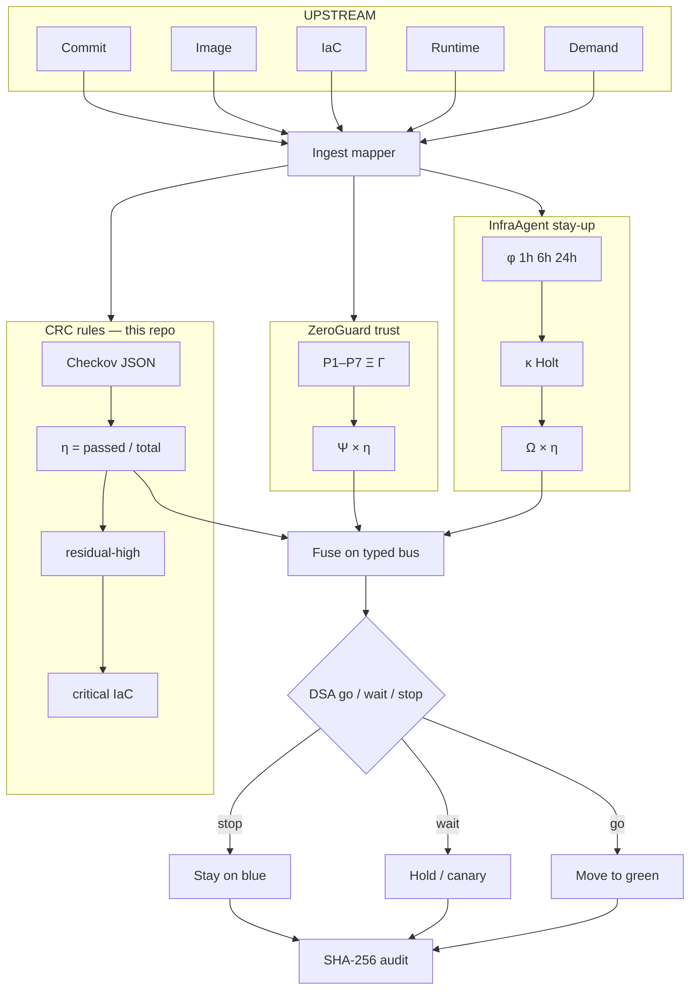
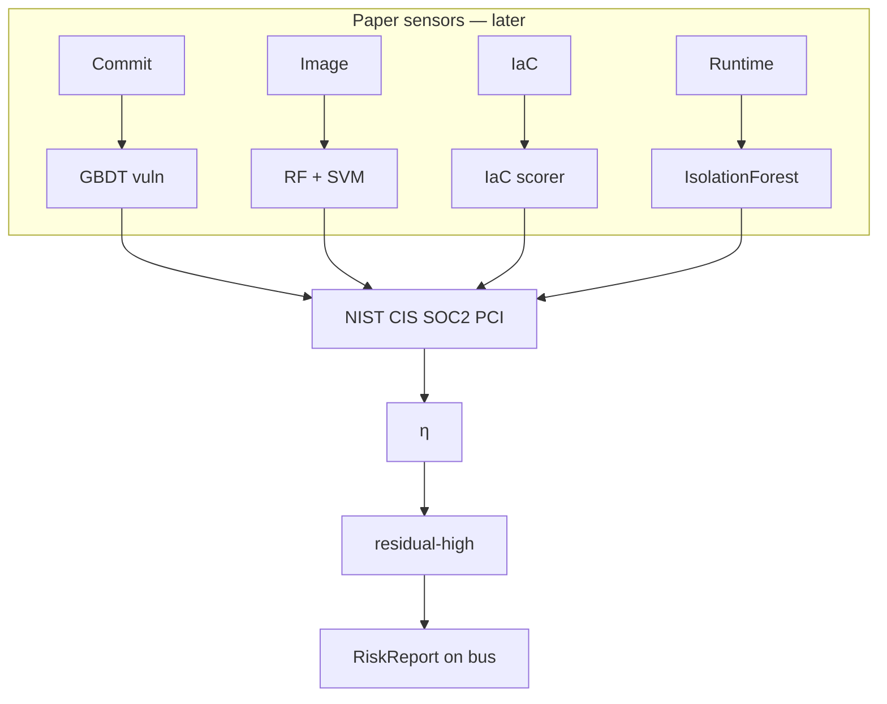
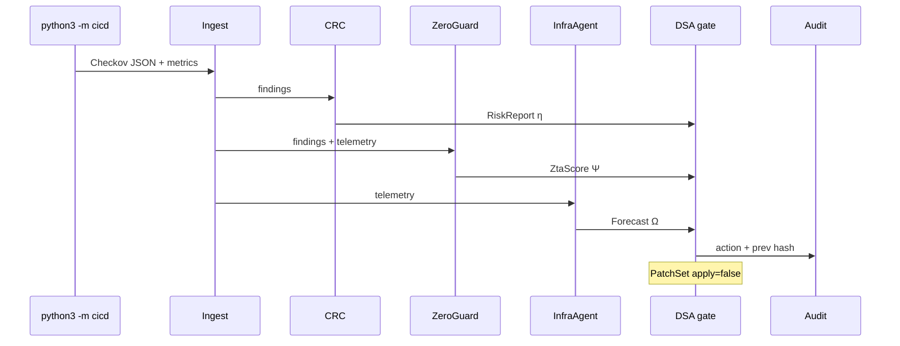

# Architecture — CRC / CI-CD plane

GitHub: [harishapuri/CICD_Compliance](https://github.com/harishapuri/CICD_Compliance)

This repo owns the **rules** plane (CRC, paper 207). Question: did the scanner find trouble in code, image, or setup?

Scoring still runs the **fused** gate. CRC η, ZeroGuard Ψ, and InfraAgent Ω share one bus and one go / wait / stop. `--focus` only changes what the CLI prints. Library source: [unifiedframework](https://github.com/harishapuri/unifiedframework) (vendored here as `vendor/unified_framework`).

Sibling planes: [infraagent](https://github.com/harishapuri/infraagent) (stay-up), [ZeroGuard](https://github.com/harishapuri/ZeroGuard) (trust).

## This repo in the loop

```
Checkov JSON + optional telemetry
                ↓
Ingest (vendor/unified_framework)
                ↓
CRC η, residual-high, critical IaC   ← this plane
ZeroGuard Ψ · InfraAgent Ω           ← still computed
                ↓
Typed bus → DSA go / wait / stop
                ↓
SHA-256 audit · suggest only · shadow unless --enforce
```

Customers (or production traffic) move **only after** go. This plane does not auto-apply patches.

## All in one — upstream to downstream



## CRC complete flow (paper 207)



**Shipped in this repo:** skip the four ML sensors. `checkov -o json` is the control set. η and residual-high come from passed/failed debt. `python3 -m cicd --focus` prints CRC plus the fused decision.

## Gate (same join as unified)

```
η multiplies both Ψ and Ω.

BLOCK  if  φ_1h > 0.7  OR  residual-high  OR  critical IaC
WARN   if  φ_6h > 0.5  OR  any ZTA pillar < 0.5  OR  κ > 0.15
PASS   otherwise → ALLOW

Autonomy α2: audit, annotate, block high/critical; never auto-apply.
```

Open-door IaC on calm traffic still **stops** (rules/trust). Clean scan on hot traffic still **undoes** (stay-up). CRC-only dashboards miss the second case; the fused pick does not.

## One pipeline run



## Feedback loop

```
shadow pick  →  record actual  →  scorecard  →  ready_for_enforce?  →  --enforce
```

The signed audit is never rewritten. Outcomes append beside it.

## File map (this repo)

| Path | Role |
| --- | --- |
| `cicd/cli.py` | Checkov → orchestrator; `--focus` / `--enforce` |
| `cicd/demo.py` | SSE site on http://127.0.0.1:8871/ |
| `cicd/automate.py` | Headless seven stories |
| `vendor/unified_framework/framework/crc/` | η, residual |
| `vendor/unified_framework/framework/flow.py` | Ingest → three planes → gate → audit |
| `.github/workflows/gate.yml` | Tests + automate + shadow pass |
